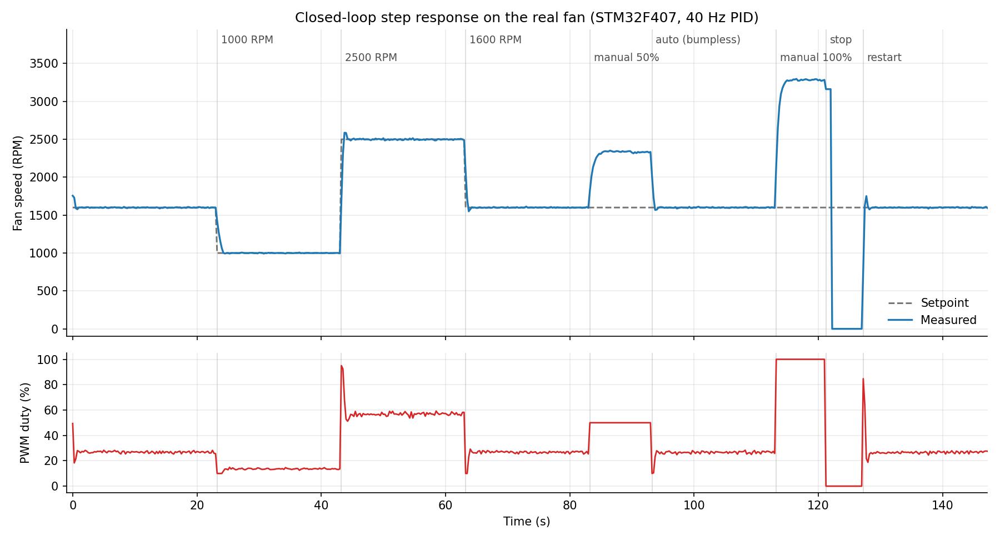

# STM32 PID Fan Controller

A closed-loop fan speed controller built on STM32F407VG. The goal was to implement a real PID control system on bare metal with FreeRTOS, and actually understand what I was building rather than copy-pasting examples.



## Why FreeRTOS

This project could have been done bare-metal in a single loop. FreeRTOS was a deliberate choice to learn it — task priorities, semaphores, and shared state protection under preemption. The three-task structure reflects real concerns: the tachometer needs to respond to hardware events immediately, the PID loop needs to run at a fixed rate, and telemetry shouldn't interfere with either. Using FreeRTOS forced me to think about race conditions and synchronization that a single-loop approach would have hidden.

## How It Works

The fan speed is measured via a tachometer signal on PA0 — two pulses per revolution, falling edge interrupt. Each pulse timestamp is captured from TIM2 (1µs resolution, 32-bit free-running counter), and the RPM is calculated from the interval between consecutive pulses. Readings above 10 000 RPM are discarded as noise. If no pulse arrives within 1 second, the fan is considered stalled and RPM is set to zero.

The PID loop runs at 40Hz. Output is feedforward + P + I + D, where the feedforward is a 9-point lookup table with linear interpolation, calibrated open-loop against this specific fan. Derivative is calculated on measurement rather than error, which avoids the kick on setpoint changes, and is skipped when the measurement steps to or from zero (spin-up, stall). Anti-windup works in two layers: the integral is clamped to the headroom left after the feedforward contribution, and it stops integrating while the total output is saturated in the direction of the error (conditional integration).

Transitions from manual PWM mode back to automatic control use bumpless transfer — the integral is back-calculated from the current output so the fan doesn't jerk.

Settings (Kp, Ki, Kd, max RPM) are saved to flash sector 11 and loaded on boot. See [Settings persistence](#settings-persistence).

## Hardware

- **Board**: STM32F407G-DISC1 (STM32F407VG, 168MHz)
- **Fan**: standard 4-pin PC fan, 12V
- **Fan control**: 2.5kHz PWM on PD12 (TIM4 CH1)
- **Tachometer**: EXTI0 on PA0, falling edge, 2 pulses/rev, internal pull-up
- **Interface**: USB CDC virtual COM port on the micro-USB connector (CN5, PA11/PA12)

### Wiring

```
   12V supply                              4-pin fan
   ┌──────────┐                       ┌───────────────────┐
   │     +12V ├───────────────────────┤ 2  +12V   (yellow) │
   │      GND ├──────────┬────────────┤ 1  GND    (black)  │
   └──────────┘          │      ┌─────┤ 3  TACH   (green)  │
                         │      │  ┌──┤ 4  PWM    (blue)   │
   STM32F407G-DISC1      │      │  │  └───────────────────┘
   ┌─────────────────┐   │      │  │
   │ GND  ●──────────┼───┘      │  │   shared ground (required)
   │ 3V   ●──[6.8k]──┼───┐      │  │   optional external pull-up
   │ PA0  ●──────────┼───┴──────┘  │   tach input
   │ PD12 ●──────────┼─────────────┘   PWM output
   │ CN5 micro-USB   ├── PC (USB CDC: telemetry + commands)
   │ CN1 mini-USB    ├── PC (power + ST-LINK flashing)
   └─────────────────┘
```

| Fan pin | Signal | Connect to |
|---|---|---|
| 1 | GND | supply GND **and** board GND |
| 2 | +12V | 12V supply only |
| 3 | Tach (open collector) | PA0 |
| 4 | PWM | PD12 |

Notes:
- Never connect 12V to the board. The tach pull-up goes to the board's **3V** pin.
- The internal pull-up on PA0 (~40kΩ) is enough with short wires; add 4.7–10kΩ to 3V if readings are noisy.
- PA0 is also the board's blue USER button — pressing it while running injects false tach pulses.
- PD12 also drives the green LED (LD4), so it visibly follows the PWM duty.
- During reset/flashing PD12 is not driven, and most 4-pin fans run at full speed when their PWM input floats. This is expected.
- 2.5kHz is below the 25kHz in the 4-pin fan spec; the fan used here handles it, others may hum or ignore PWM.

## Control Architecture

**PID Loop — 40Hz** (`Core/Src/pid.c`)
- Output range: 10–95% (0% only when setpoint is 0)
- Feedforward: 9-point LUT, 740–2830 RPM → 10–90% PWM
- Anti-windup: integral clamped to the post-feedforward headroom, plus conditional integration while saturated
- Derivative on measurement, skipped across 0 RPM transitions

**Task Structure**
- `tachoTask` (High priority): event-driven, wakes on semaphore from the EXTI0 ISR
- `pidTask` (Normal priority): fixed 25ms period via `osDelayUntil`; resyncs instead of bursting if a deadline is missed; services the watchdog
- `usbTask` (Normal priority): fixed-rate 250ms telemetry; performs flash saves and sends command replies on behalf of the USB ISR; the only caller of `CDC_Transmit_FS`

**Thread Safety**

Commands arrive in the USB OTG **interrupt** (`CDC_Receive_FS` → `process_usb_command`), not in a task. `osKernelLock` only stops task switching — it does not mask interrupts — so it cannot protect anything the ISR writes. The model is:

| Data | Writer | Readers | Protection |
|---|---|---|---|
| setpoint, manual mode/PWM, bumpless flag, Kp/Ki/Kd, max RPM | USB ISR | pidTask, usbTask | Read together inside a short interrupts-disabled section (`read_control_inputs`) for a consistent snapshot |
| `measured_rpm` | tachoTask | pidTask, usbTask | Single aligned 32-bit word — atomic on Cortex-M4, no lock |
| `pid_output` | pidTask | usbTask | Same |
| tach capture timestamp | EXTI0 ISR | tachoTask | Read once per pulse into a local |
| PID integral / derivative state | pidTask only | — | Owned by one task; tach timeouts are signalled with a flag instead of writing the integral from another task |

The ISR never blocks, erases flash or transmits: `save` and invalid-command replies are handed to `usbTask` with thread flags.

## Settings Persistence

- Stored in flash sector 11 (`0x080E0000`). The linker script limits the code region to 896K so the sector can never contain code.
- The record has a magic number and a layout version. The payload is programmed first and the magic word **last**, so a power loss mid-save never leaves a valid-looking record.
- On boot every value is checked (finite, non-negative gains, max RPM in range); an invalid record is ignored and defaults are used.
- Erasing a 128KB sector takes ~1–2s and the STM32F407 cannot fetch instructions from flash during the erase, so **the whole MCU pauses during `save`**. The PWM keeps running in hardware, the PID loop resyncs afterwards, and the tach measurement discards the interval that spans the pause.

## Watchdog

The independent watchdog (IWDG) is started just before the scheduler with a ~8s timeout (≥5.4s worst case over the LSI tolerance — longer than the flash-erase pause). `pidTask` refreshes it every cycle, but only while `tachoTask` and `usbTask` have checked in within the last 3s, so a hang in any task or in the scheduler resets the MCU. After a watchdog reset the orange LED (LD3) is on and the first serial line is `WARN: previous reset was caused by the watchdog`. `Error_Handler` turns on the red LED (LD5) and halts; the watchdog then resets the board. The IWDG is frozen while a debugger halts the core.

## Serial Commands

Case-insensitive, one per line:

| Command | Description |
|---------|-------------|
| `s<value>` | Set RPM setpoint (≥ 0, limited to the max RPM); leaves manual mode |
| `m<value>` | Manual PWM mode (0–100%) |
| `p<value>` | Set Kp (≥ 0) |
| `i<value>` | Set Ki (≥ 0) |
| `d<value>` | Set Kd (≥ 0) |
| `r<value>` | Set max RPM limit (100–10000); also lowers the setpoint if it is above |
| `save` | Save Kp, Ki, Kd and max RPM to flash → `OK: saved` / `ERR: save failed` |

Values must be plain numbers (`nan`, `inf` and overflow are rejected). Anything that does not parse returns `ERR: invalid command`; valid commands are silent and show up in the telemetry.

## Telemetry Output

```
Time:   12.50, Set: 1600.0, Meas: 1598.3, PWM: 31.4
Time:   12.75, Set: 1600.0, Meas: 1601.7, PWM: 31.2
```

## Building, Flashing and Testing

Requires `arm-none-eabi-gcc` and `make`.

```bash
make                 # firmware -> build/PID.elf / .hex / .bin
make test            # host-side unit tests (gcc, no hardware needed)
```

**Flashing**: the ST-LINK on the Discovery board shows up as a USB drive (`DIS_F407VG`). Copy the binary onto it and the board reprograms and resets itself:

```bash
cp build/PID.bin /media/$USER/DIS_F407VG/
```

**Serial port access (Linux)**: add yourself to the `dialout` group once, then log out and back in:

```bash
sudo usermod -aG dialout $USER
```

Manual clock configuration for 168MHz operation. Do not regenerate from STM32CubeMX — it will break the working configuration.

### Unit tests

`tests/test_main.c` covers the hardware-independent modules: feedforward interpolation, PID clamping, anti-windup and bumpless transfer, a closed-loop simulation against a first-order fan model, tach period conversion (including TIM2 wrap-around), the command parser (NaN/inf, overflow, `save` matching, overlong lines) and settings validation (half-written and corrupted records).

### Hardware test

`fan_test.py` drives the real fan through a fixed sequence (startup, step changes, manual/bumpless, full duty, stop/restart, and with `--extended` input rejection, max-RPM clamping and `save`), records all telemetry to CSV, prints overshoot / settling time / steady-state error per step and saves a plot:

```bash
pip install -r requirements.txt
python3 fan_test.py --label run1 --extended
```

## Python Interface

`fan_controller.py` handles simultaneous telemetry display and command input using two threads. It finds the board automatically by its USB ID; use `--port` to override.

## Test Results

Measured on the real fan with `fan_test.py --extended`:

| Test | Result |
|---|---|
| Hold at 1600 RPM | ±10 RPM |
| Step 1600 → 1000 RPM | 1.7% overshoot, settles in 0.75 s |
| Step 1000 → 2500 RPM | 10.8% overshoot, settles in 0.75 s |
| Step 2500 → 1600 RPM | 10.5% overshoot, settles in 0.5 s |
| Manual 50% → auto 1600 RPM (bumpless) | 7.5% overshoot, settles in 0.25 s |
| Restart from standstill | 18.5% overshoot, settles in 0.5 s |
| Startup after reset | peak PWM 49%, no full-power burst |
| `pnan` / `snan` / `sinf` / `x1` | rejected with `ERR: invalid command`, setpoint unchanged |
| `r2000` then `s2500` | setpoint limited to 2000 RPM |
| `save` | `OK: saved`, no visible speed disturbance, no watchdog reset |

The biggest improvement came from conditional integration: the integral no longer winds up while the output is saturated. Large-step overshoot dropped from 20–27% to about 11%, and settling time from 2–4 s to under 1 s. The remaining overshoot is on large steps and on restart from standstill, where the output starts at the 95% clamp.

## Project Structure

```
Core/Src/main.c            init, RTOS tasks, ISRs, shared state
Core/Src/pid.c             feedforward + PID (pure, unit-tested)
Core/Src/tacho.c           tach period -> RPM (pure, unit-tested)
Core/Src/command.c         serial line assembly and parsing (pure, unit-tested)
Core/Src/settings.c        settings record validation (pure, unit-tested)
Core/Src/settings_flash.c  settings flash erase/program/read
Core/Inc/app_config.h      all tuning constants and limits
tests/test_main.c          host unit tests (make test)
fan_controller.py          interactive console
fan_test.py                automated hardware test + plots
docs/                      README images
design_notes.pdf           clock tree, task, PID and peripheral diagrams
```

## Possible Improvements

- `save` pauses the MCU for ~1–2s (single-bank flash). Running the erase from RAM, or using a small 16KB sector, would shorten or hide it.
- Large steps and restarts from standstill still overshoot 10–20%. The fan is ~3× more sensitive to PWM at low speed than at high speed, so gain scheduling from the feedforward slope would help.
- PWM is 2.5kHz rather than the 25kHz in the 4-pin fan spec.
- Bumpless transfer only handles manual→auto; auto→manual has no equivalent.
- The feedforward table is calibrated for one specific fan.
- No CI yet; a GitHub Actions job running `make` and `make test` would be the next step.

## Third-Party Code

Vendored under `Drivers/` and `Middlewares/`, unmodified:

| Component | Version | Source | License |
|---|---|---|---|
| STM32F4 HAL driver | reports 1.8.5; byte-identical to `stm32f4xx_hal_driver@1f6451c` (newer than the v1.8.5 tag) | [STMicroelectronics/stm32f4xx_hal_driver](https://github.com/STMicroelectronics/stm32f4xx_hal_driver) | BSD-3-Clause |
| CMSIS device STM32F4 | 2.6.11; byte-identical to `cmsis_device_f4@a833f4a` | [STMicroelectronics/cmsis_device_f4](https://github.com/STMicroelectronics/cmsis_device_f4) | Apache-2.0 |
| CMSIS Core | 5.x (`core_cm4.h` V5.1.2) | [ARM-software/CMSIS_5](https://github.com/ARM-software/CMSIS_5) | Apache-2.0 |
| FreeRTOS kernel + CMSIS-RTOS2 wrapper | V10.3.1 | STM32CubeF4 | MIT (kernel), Apache-2.0 (wrapper) |
| STM32 USB Device Library | V2.11.4 | STM32CubeF4 | ST SLA0044 |

Each directory contains its upstream LICENSE file. Only about 35 of these sources are compiled (see `C_SOURCES` in the Makefile); the rest of the trees are kept as shipped.

## License

The project's own code is MIT licensed — see [LICENSE](LICENSE). Third-party code keeps its own license (above).
